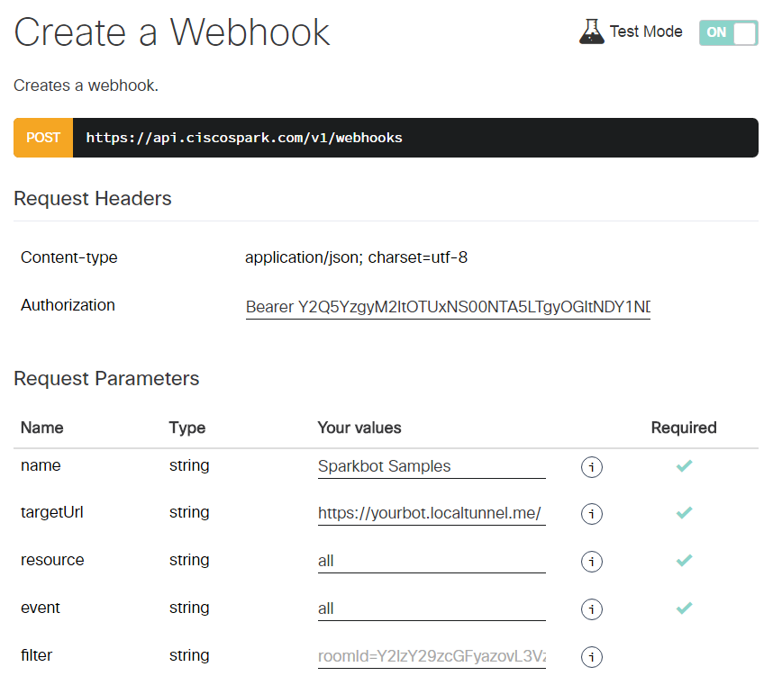

# Cisco Spark WebHook Examples in NodeJS

Interested in creating your own Cisco Spark bot, pick an example that suits your scenario, and customize it.

To run your bot, simply take the Quick Start below, or take the DevNet Tutorial for a Step by step guide


## Run locally

``` bash
> git clone 
> cd 
> npm install
> node minimalists.js
Cisco Spark Bot started at http://localhost:8080/
   GET  / for Health checks
   POST / receives Spark Webhook events
```

Check your bot is accessible by hitting its heath endpoint at http://localhost:8080/

``` bash
// In another terminal, run
> curl http://localhost:8080/
{
  "message": "Congrats, your Cisco Spark bot is up and running",
  "since": "2016-08-24T15:09:59.412Z",
  "code": "minimalist.js",
  "tip": "Register your bot as a WebHook to start receiving events: https://developer.ciscospark.com/endpoint-webhooks-post.html"
}
```

## Expose your bot on the Web with localtunnel

Replace *mybot* with a unique name so that you do not mess up with other developers,
and run the following commands:

``` bash
> npm install localtunnel -g
> lt -s mybot -p 8080
your url is: http://<yourbot>.localtunnel.me
```

Check your bot is accessible by hitting its heath endpoint at https://*yourbot*.localtunnel.me/
Note: make sure you hit the _secured_ HTTPS endpoint.  

``` bash
// In another terminal, run
> curl https://<yourbot>.localtunnel.me/
{
  "message": "Congrats, your Cisco Spark bot is up and running",
  "since": "2016-08-24T15:09:59.412Z",
  "code": "minimalist.js",
  "tip": "Register your bot as a WebHook to start receiving events: https://developer.ciscospark.com/endpoint-webhooks-post.html"
}
```


## Register your bot as a Spark WebHook

Last step, is to create a Spark Webhook for your bot.

This can be done via the Cisco Spark Developer Portal / [Create a WebHook](https://developer.ciscospark.com/endpoint-webhooks-post.html) interactive documentation,
but also via Postma or a CURL command as will see right after.

For the scope of this example, we'll associate our bot to all resources and events.

Note that even if the minimalist bot sample can process all events, you can register a webhook with a more limited set of events. Only these will be fired to your bot then.




As an alternative, you can run this CURL command.

``` bash
> curl -X POST -H "Content-Type: application/json" -H "Authorization: Bearer YOUR_SPARK_TOKEN" -d '{
        "name": "Sparkbot Samples",
        "resource": "all",
        "event": "all",
        "targetUrl": "https://yourbot.localtunnel.me/"
    }' "https://api.ciscospark.com/v1/webhooks/"
```


Or you can also create this webhook via Postman.


# To go further

- Run other examples in this repo
- Take the DevNet Learning labs related to these code samples.
- Learn to host your bot on a public cloud.


