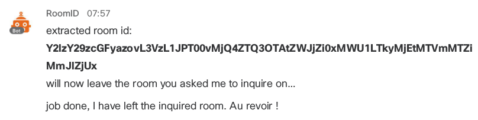

# Cisco Spark WebHook Examples in nodejs

Interested in creating your own Cisco Spark bots ? Pick an example that suits your scenario, and customize it.

To run any of these examples, follow the [How to run on Cloud9](docs/HowToRunOnCloud9.md) or [How to run locally](docs/HowToRegisterOnSpark.md) guide.

The examples below leverage the [sparkbot-webhook](sparkbot) nodejs library.  
To learn more about the library, check the [tests](tests/README.md) examples.

To go further, take a [DevNet Learning lab](https://learninglabs.cisco.com/labs).

## [inspect](examples/inspector.js)

Provides instant access to Cisco Spark technical data.

Features illustrated by this example:
- **Help command to display available commands**
- **About command to get meta info about the bot**
- **Welcome message as the bot is added in a room**
- **Fallback message if a command is not recognized**

This bot can be run as is with either a Developer or a Bot access token 

Invite _inspect@sparkbot.io_ to meet the bot.

## [roomId](examples/roomid-phantom.js)

Fetches the identifier of the room in which this bot has just been added, 
pushes the roomId via a direct message, and leaves the inquired room right away.

Features illustrated by this example:
- Help command to display available commands
- About command to get meta info about the bot
- Fallback message if a command is not recognized
- **Send a direct message and leaves the room**

Invite _roomid@sparkbot.io_ to meet the bot.

## [room-stats](examples/room-stats.js)

Computes stats for the room it is invoked from. 

Features illustrated by this example:
- Help message to display bot commands
- Welcome message as the bot is added in a room
- **Custom command prefix #**
- **Markdown formatting with lists & mentions**
- **Runs with a Developer account**

Note that this webhook must be run with a Developer access token (either your's or a fake Spark account), because we must fetch all messages from rooms, not only those where bot is mentionned.

Invite _stats@chatbot.land_ to meet the bot.

## [events](examples/devnet/bot.js)

Tells you about upcoming DevNet events.

Features illustrated by this example:
- Help command to display available commands
- About command to get meta info about the bot
- Welcome message as the bot is added in a room
- Fallback message if a command is not recognized
- **Command with integer argument** 
- **Invokes a public REST API: [devnet-events-api](https://devnet-events-api.herokuapp.com/api/v1/events?limit=100)**
- **Markdown formatting with lists and hyperlinks**

Invite _CiscoDevNet@sparkbot.io_ to meet the bot.

## [dilbert](examples/dilbert/bot.js)

Fetches latest comic from Dilbert Strip (with invitation ad to visit the Web Site)

Features illustrated by this example:
- Help command to display available commands
- Welcome message as the bot is added in a room
- Fallback message if a command is not recognized
- **Command with a date argument**
- **HTML scraping**
- **Markdown formatting and file attachment**

Note this bot is provided as an example and should not be deployed without the consent of Dilbert Comics Strip. 
Go thru the [guide](examples/dilbert) to deploy locally for learning purposes.

